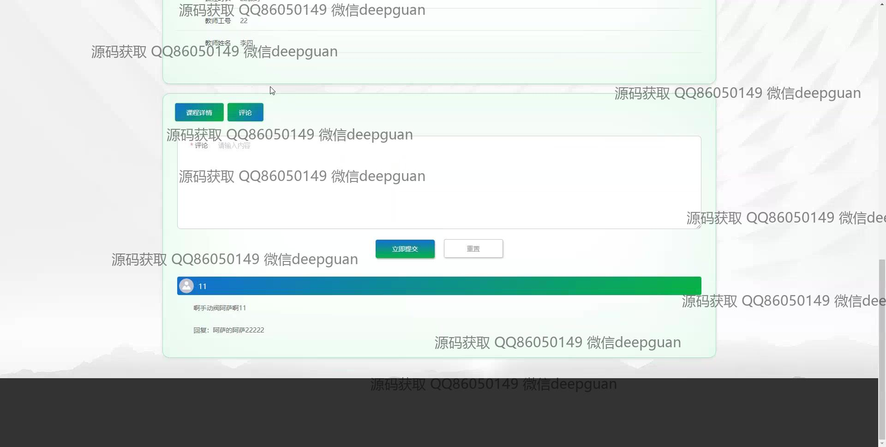
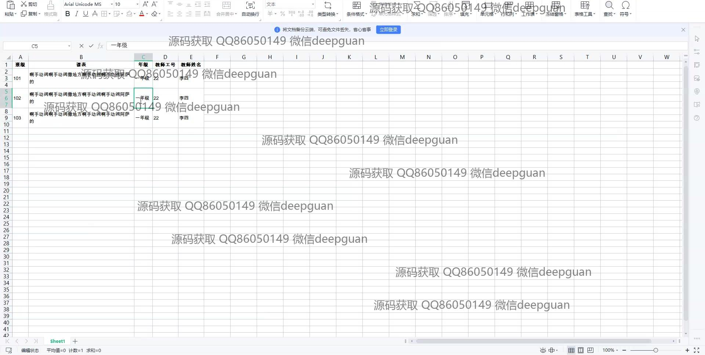
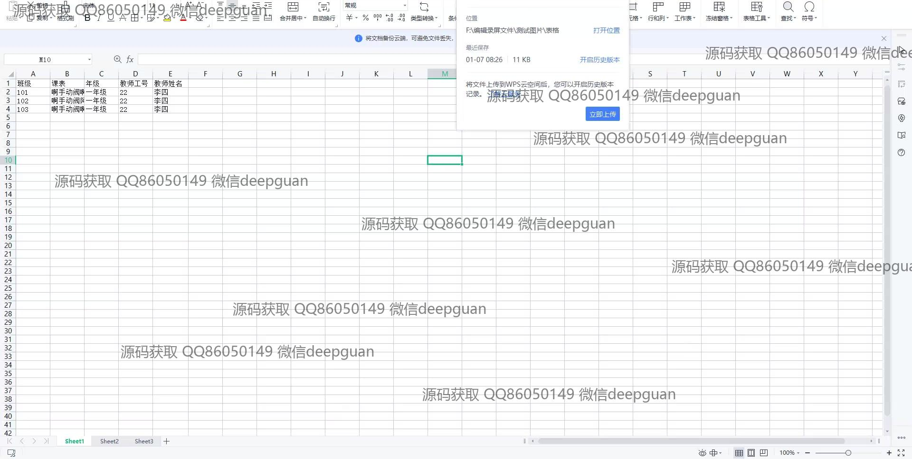

<h1 align="center">课表管理系统</h1>

## 简介
课表管理系统：角色分为学生、教师、管理员；提供课程查询、添加、编辑和删除功能；支持课程安排管理及调课申请；含用户注册、信息维护、课程评论与互动，实现高效信息交流与管理。    --计算机毕业设计源码；毕设源码；java毕业设计源码

## 联系方式

<h3 align="center">获取完整代码与数据库文件 + 微信：deepguan QQ: 86050149 QQ群: 783742310</h3>

<h3 align="center">可帮忙远程部署 包运行成功！提供远程部署、修改代码、设计文档指导、代码讲解等服务！</h3>

## 功能介绍（完整见运行截图）
管理员：注册、登录、退出等基本账户管理功能，支持课程信息的添加、修改、删除和查看；可管理班级课程安排，审核和处理调课申请；具备权限分配功能，确保不同角色访问对应权限，提升系统安全性；界面简洁明了，内置导航菜单，便于快速访问各模块。

教师：能够注册账户并登录系统，查看课程安排和班级课表；支持课程信息的录入和编辑，填写课程内容细节；可以上传课程图片，选择授课时间和地点；通过平台提交调课申请，查看审核进度和结果，系统设计助力高效课程管理。

学生：注册账户后即可查看个人课程安排，快速浏览课程详情和时间表；支持选择和收藏相关课程，查看并参与课程评论；通过平台获取个人信息、课程表等重要文档，实现课表和信息的便捷管理，提高学习效率。

访客：无需注册便能够访问课表管理系统的公开信息模块，例如首页、校园资讯和课程列表；可以浏览教师和课程的基本信息，通过评论区了解课程反馈；访客访问权限有限，需注册为正式用户以使用更多功能。

## 运行截图

本代码来源于网络,仅供学习参考使用!

